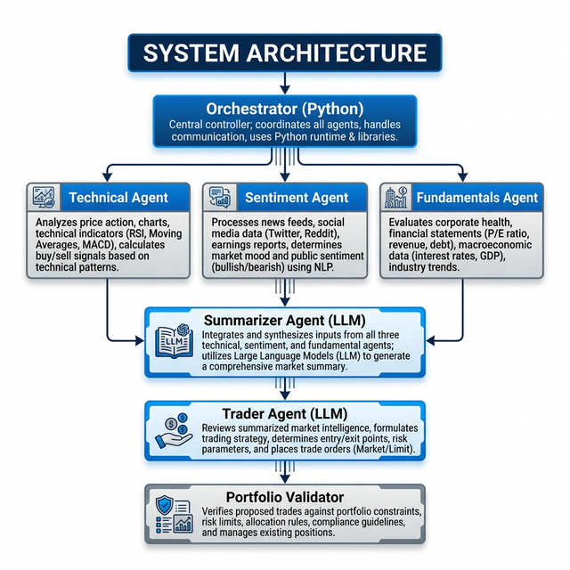

# Trading-Agent (LLM Multi-Agent Financial System)

A unified autonomous stock analysis and portfolio allocation platform. The system leverages an orchestrator to run parallel domain-expert LLM agents (Technical, Sentiment, and Fundamental Analysis), synthesizes their findings into a cohesive narrative, and passes the intelligence to a Trader Agent which sizes positions via mathematical models dynamically checked by a Portfolio Validator.



## 🚀 Quick Start

1. **Install Dependencies**
   The project uses `uv` for package management, but pip can be used with the included `pyproject.toml`.
   ```bash
   python3 -m venv .venv
   source .venv/bin/activate
   pip install -r requirements.txt # or uv sync
   ```

2. **Run Full Analysis (CLI)**
   The orchestrator runs the full pipeline for multiple tickers.
   ```bash
   python backend/run_analysis.py --tickers AAPL,NVDA,MSFT
   ```

3. **Run the React UI**
   Start the FastAPI backend and React frontend in two terminals:
   ```bash
   # Terminal 1 — Backend API
   source .venv/bin/activate
   python -m uvicorn backend.main:app --port 8000

   # Terminal 2 — React Frontend
   cd frontend
   npm install   # first time only
   npm run dev
   ```
   Open `http://localhost:5173` in your browser.

## 🖥️ Architecture

The project follows a clean separation of concerns with two top-level modules:

```
Trading-Agent/
├── backend/                  ← All Python / agent / API code
│   ├── main.py               ← FastAPI server
│   ├── run_analysis.py       ← Orchestrator pipeline
│   ├── technical_agent/
│   ├── sentiment_agent/
│   ├── fundamentals_agent/
│   ├── summarizer_agent/
│   ├── trader_agent/
│   └── portfolio_validator/
├── frontend/                 ← React (Vite) UI
│   ├── src/
│   └── package.json
├── results/                  ← Saved JSON outputs
├── pyproject.toml
└── .env
```

| Layer | Technology | Path |
|-------|-----------|------|
| **Frontend** | React (Vite) | `frontend/` |
| **Backend API** | FastAPI + Uvicorn | `backend/main.py` |
| **Analysis Engine** | Python (LangGraph, LangChain) | `backend/run_analysis.py` + agent modules |

### API Endpoints

| Method | Path | Description |
|--------|------|-------------|
| `POST` | `/api/analyze` | Launch a multi-agent analysis (runs in background) |
| `GET` | `/api/status/{job_id}` | Poll analysis job progress |
| `GET` | `/api/results` | List all past result files |
| `GET` | `/api/results/{filename}` | Load a specific past result |
| `GET` | `/api/health` | Health check |

## 🛠️ The Agents

### 1. Technical Analyst Agent
- Fetches OHLCV data and computes comprehensive indicators (Dual RSI, MACD, Bollinger Bands, ATR, Supertrend, etc.).
- Evaluates 12+ standard mathematical signals dynamically.
- Automatically handles overbought/oversold boundaries dynamically for volatile tech stocks.

### 2. Multi-Agent Sentiment Agent
- A sequential *LangGraph* pipeline designed to respect free-tier API rate limits.
- Incorporates and scores data from:
  - **News**: Global headlines (Finviz, Yahoo).
  - **Social**: Reddit keyword buzz (ApeWisdom).
  - **Analysts**: Wall Street Ratings (Finnhub).
  - **Web**: General blog/context searches (DuckDuckGo).
- Uses a weighted aggregator (Analyst 40%, News 35%, Social 15%, Web 10%).

### 3. Fundamentals Agent
- Fetches primary financial statements from `yfinance` with AlphaVantage fallback.
- Computes core ratios (P/E, Profit Margins, Debt/Equity).
- Serves as the ultimate quality gate via the **9-criterion Piotroski F-Score**. Any stock scoring <= 2 is hard-overridden to HOLD.

### 4. Summarizer Agent
- A sophisticated LLM synthesize node that ingests the conflicting numerical and text signals from the previous three agents to build a human-readable recommendation card.

### 5. Trader Agent & Portfolio Validator
- Acts as the portfolio manager. Translates textual "Conviction" and "Expected Return" into quantitative inputs.
- Chooses dynamically from four position sizing algorithms: *Equal Weight, Conviction Weight, Volatility Parity, and Half-Kelly (Kelly Criterion)*.
- The **Portfolio Validator** strictly enforces a 40% single-asset cap and guarantees a 10% uninvested cash floor.

## ⚙️ Configuration (.env)

Create a `.env` file in the project root. The system primarily relies on Groq for Trader logic and Gemini for Sentiment scoring, though both can be globally re-mapped.

```env
# --- Main Providers ---
LLM_PROVIDER=groq
GROQ_API_KEY=your_groq_key
GROQ_MODEL=llama-3.3-70b-versatile

GEMINI_API_KEY=your_gemini_key
GEMINI_MODEL=gemini-2.0-flash

# --- Data APIS ---
FINNHUB_API_KEY=your_finnhub_key
ALPHAVANTAGE_API_KEY=your_alphavantage_key

# --- Configs ---
LANGCHAIN_TRACING_V2=true 
LANGCHAIN_API_KEY=your_langsmith_key
```

## 📊 Output
Results are saved as JSON cache files in the `./results/` directory, while logs output directly into the stream. When using the React UI, a rich dashboard with portfolio allocation charts, per-ticker detail tabs, and risk validation panels is available.
