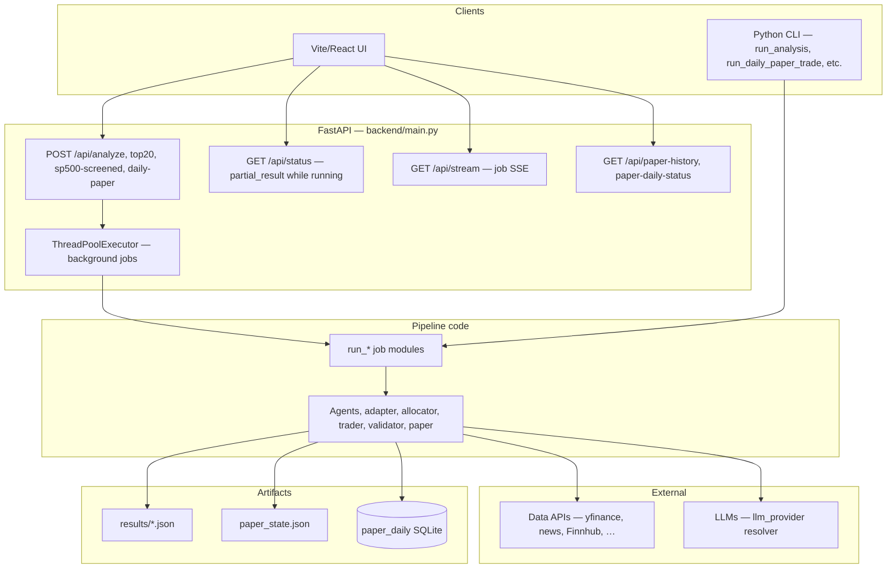
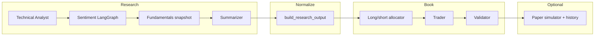
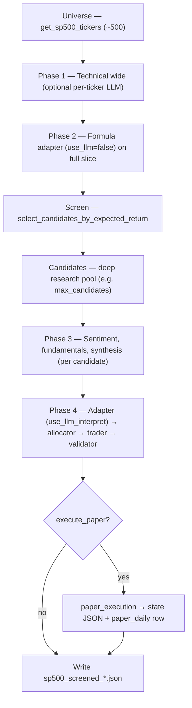

# Trading-Agent — End-to-End Project Guide

This document is the **full-stack narrative** of the Trading-Agent codebase: what each component does, how data flows, and how the three analysis modes differ. **Section 2** has **Mermaid architecture diagrams** (system context, logical layers, S&P 500 phase flow). The **S&P 500 screened** pipeline is also written out in prose in **section 7**. For a compact stage-by-stage reference and troubleshooting (N/A sizing, HOLD-heavy books), see [PIPELINE.md](./PIPELINE.md).

---

## 1. What this project is

Trading-Agent is a **research and portfolio-simulation stack**, not a live brokerage integration. It:

1. Pulls market and text data for equities.
2. Runs **domain agents** (technical rules, sentiment LangGraph, fundamentals snapshot, synthesis).
3. Normalizes everything into **structured recommendations** (`StockRecommendation`: signal, conviction, expected return, volatility).
4. Optionally runs a **long/short allocator** and an **allocator-aligned trader** that emit target weights and human-readable orders.
5. **Validates** the proposed book against risk rules.
6. Optionally **rebalances a local paper portfolio** (JSON state + SQLite history) — still no real orders.

The **React UI** (`frontend/`) drives the same jobs as the CLI/API: custom tickers, a fixed **Top 20** book, and **S&P 500 screened** (wide technicals → screen → deep research on a small candidate set).

---

## 2. Architecture diagrams

Diagrams below use [Mermaid](https://mermaid.js.org/) syntax. They render on GitHub, GitLab, many IDEs, and VS Code/Cursor Markdown previews.

### 2.1 Clients, API, and execution

SSE and status polling apply when the job was started via the API; the CLI talks to the same **job modules** and **agent stack** but skips the HTTP layer and stream queues.

### 2.2 Logical layers (research → book)

**Custom** analysis uses a **ReAct** trader after `A` instead of the allocator-first path; **Top 20** and **S&P 500 screened** run **allocator → allocator-backed trader** so weights and validation stay aligned.

### 2.3 S&P 500 screened — phase flow

---

## 3. Repository map

| Area | Role |
|------|------|
| `backend/main.py` | FastAPI: job lifecycle, `GET /api/status/{job_id}`, `GET /api/stream/{job_id}` (SSE), paper history endpoints. |
| `backend/run_analysis.py` | Custom pipeline: full research per ticker → **ReAct trader** (four sizing methods). |
| `backend/run_top20_longshort_job.py` | Fixed ~20-name universe → full research → allocator → **allocator-backed trader**. |
| `backend/run_sp500_screened_job.py` | ~500 names technical → **formula screen** → research only on candidates → allocator → trader → validation → optional paper. |
| `backend/run_daily_paper_trade.py` | CLI daily S&P-style run; same screening idea, tuned for automation. |
| `backend/universe/sp500.py` | S&P 500 constituent list (Wikipedia + cache + bundled fallback). |
| `backend/universe/screen.py` | `select_candidates_by_expected_return` — shared screening logic. |
| `backend/universe/top20.py` | Curated large-cap list for the Top 20 mode. |
| `backend/technical_agent/` | OHLCV, indicators, rule signals, optional per-ticker technical LLM summary. |
| `backend/sentiment_agent/` | LangGraph orchestrator (news, social, analyst, web, debate, aggregate). |
| `backend/fundamentals_agent/` | Tools and optional LangGraph agent; main jobs often use `fetch_fundamentals_data` snapshot. |
| `backend/summarizer_agent/` | One Markdown synthesis per ticker from technical + sentiment + fundamentals. |
| `backend/trader_agent/` | `adapter.py` (`build_research_output`), `agent.py` (ReAct vs allocator path), `tools.py` (`generate_trade_orders`). |
| `backend/portfolio_longshort/` | Deterministic long/short weight construction. |
| `backend/risk_portfolio_agent/` | Thin wrapper/config around the allocator. |
| `backend/portfolio_validator/` | Risk report on orders + recommendation metrics. |
| `backend/paper_simulator/` | `rebalance_to_target_weights`, metrics. |
| `backend/paper_execution.py` | Optional rebalance after API jobs; wires closes from technical payload. |
| `backend/portfolio_history/` | SQLite `paper_daily` append + queries. |
| `backend/llm_provider/` | Central provider resolution (Mistral, Groq, Gemini, …, Ollama fallback), Mistral throttle, optional SSE-forwarding observed chat wrapper. |
| `backend/streaming_context.py` | Thread-local SSE emitter + LLM start/end timing (job-scoped keys, locked structures). |
| `frontend/` | Vite + React: Run pipeline (three modes), results dashboard, paper performance. |
| `results/` | JSON run artifacts, `paper_state.json`, SQLite history file (default under `results/`). |

---

## 4. Runtime architecture

### 4.1 Jobs and threads

Long runs are **not** executed on the FastAPI event loop. `ThreadPoolExecutor` (see `main.py`) runs each job in a **worker thread**. That thread:

- Registers the job in an in-memory `_jobs` store.
- Creates an SSE **queue** for the job id.
- Calls `set_stream_emitter(..., job_id=job_id)` so `streaming_context` routes LLM/stage events into that queue.

The UI polls `GET /api/status/{job_id}` for `status`, `result`, and `partial_result` (live snapshot). It may open `GET /api/stream/{job_id}` for token chunks, stage lines, and a final `job_done` event.

### 4.2 Partial results

While a job runs, orchestrators update `partial_result` with a **JSON-serializable copy** of the in-flight combined object (tickers, metadata.pipeline_step, per-ticker blocks, etc.). The frontend uses this for progress bars and step labels.

### 4.3 LLM routing

`backend/llm_provider/resolver.py` chooses a provider from environment variables (`LLM_PROVIDER`, API keys). If a requested cloud key is missing, it can fall back to **local Ollama**. Wrapped models can log calls and optionally forward chunks to SSE via `streaming_context`.

**Note:** LangGraph **ReAct** trader paths use an **unwrapped** chat model for composability; their internal reasoning is not streamed token-by-token. Paths that use `get_langchain_chat_model(forward_sse=True, ...)` or explicit `emit_llm_*` calls do appear in the live panel.

---

## 5. Agents and layers (what each one does)

### 5.1 Technical Analyst Agent (`technical_agent/`)

- **Input:** Ticker list, date range, interval (typically daily).
- **Data:** OHLCV via yfinance (and related tooling).
- **Output:** Per ticker: indicators (e.g. RSI variants, MACD, Bollinger, ATR, Supertrend), rule-based signal summaries, and optionally an **LLM narrative** when `enable_llm_summary` / `enable_llm_summary_technical` is true.
- **Role downstream:** Feeds structured fields into `build_research_output` and into synthesis. For S&P screening, the **formula** path uses technical-heavy inputs without LLM interpret on the wide pass.

### 5.2 Sentiment agent (`sentiment_agent/`)

- **Implementation:** `OrchestratorAgent` + LangGraph subgraphs: news, social, analyst (Finnhub when key present), web, debate, aggregation.
- **Output:** Scores and text merged into `combined["results"][ticker]["sentiment"]`.
- **Performance:** `SENTIMENT_FAST_PIPELINE` (env) reduces subgraph work (e.g. news + analyst + aggregate) for large batches — recommended for S&P candidate sets.

### 5.3 Fundamentals (`fundamentals_agent/`)

- In full API jobs, **`fetch_fundamentals_data`** (`fundamentals_agent/tools.py`) often supplies a **yfinance-first snapshot** (ratios, Piotroski-style checks, etc.) without running the full LangGraph fundamentals agent every time.
- **Output:** `combined["results"][ticker]["fundamentals"]`.

### 5.4 Summarizer agent (`summarizer_agent/`)

- **Input:** One ticker’s technical + sentiment + fundamentals blobs.
- **Output:** A single **Markdown** string: `combined["results"][ticker]["synthesis"]`.
- **Role:** Primary qualitative input when the research adapter runs **`use_llm=True`** (interpretation pass).

### 5.5 Research adapter (`trader_agent/adapter.py` — `build_research_output`)

Two modes:

| Mode | When | Behavior |
|------|------|----------|
| **Formula** | `use_llm=False` | Deterministic mapping from technical (and any filled blocks) to `StockRecommendation`: signal, conviction, **expected_return**, volatility. Used for **S&P 500 screening** on the full universe slice. |
| **LLM interpret** | `use_llm=True` | LLM refines recommendations using synthesis and structured inputs; streams under SSE when wired. Used after **deep research** on candidates in screened / Top 20 jobs. |

`StockRecommendation` is the **contract** between research, allocator, trader, and validator.

### 5.6 Long/short allocator (`portfolio_longshort/allocator.py` via `RiskPortfolioAgent`)

- **Input:** List of `StockRecommendation`.
- **Logic:** Deterministic ranking using signal direction (BUY → long side, SELL → short side, **HOLD → no directional score**), subject to `k_long`, `k_short`, gross long/short exposure, and per-name caps.
- **Output:** **Signed** `target_weights` (long positive, short negative). Names with ~zero weight are dropped from the “book.”

### 5.7 Trader agent (`trader_agent/agent.py`)

- **Custom analysis path:** `run_trader_agent` — **ReAct** loop; four **BUY-only** sizing heuristics are precomputed in Python; the model picks one and calls `generate_trade_orders` once.
- **Top 20 / S&P 500 screened:** `run_trader_from_allocator_targets` — **no ReAct**; passes allocator weights as `risk_portfolio_agent` method into `generate_trade_orders` so **orders match the allocator book** (including shorts as negative weights).

`trader_agent/tools.py` implements `generate_trade_orders`: per ticker, `weight_delta = proposed_weight - current_weight`, action from sign, and gross long/short reporting.

### 5.8 Portfolio validator (`portfolio_validator/`)

- **Input:** Orders (synthetic allocator orders for validation) + recommendation metrics.
- **Output:** `risk_level`, warnings, metrics (e.g. concentration, cash floor). Optional paper rebalance **skips** when risk is **HIGH** unless `paper_force` is set.

### 5.9 Paper simulator and history

- **`paper_simulator/simulator.py`:** Applies target weights against **current** `PortfolioState` and a **price map** (closes from technical output).
- **`paper_execution.py`:** Loads/saves `results/paper_state.json` (or custom path), runs optional rebalance after API jobs.
- **`portfolio_history`:** Appends one row per successful daily-style run into SQLite (`paper_daily`). The UI **Paper performance** page reads `GET /api/paper-history` and `GET /api/paper-daily-status`.

---

## 6. Three pipelines at a glance

| Aspect | Custom (`POST /api/analyze`) | Top 20 (`/api/analyze/top20-longshort`) | S&P 500 screened (`/api/analyze/sp500-screened`) |
|--------|------------------------------|----------------------------------------|---------------------------------------------------|
| Universe | User tickers | `universe/top20.py` | `universe/sp500.py` (~500) |
| Technical scope | Listed tickers | ~20 | **All** universe names |
| LLM per ticker on full index | Optional | Optional | **`enable_llm_summary_technical`** (default **off**) |
| Screen | No | No | **Yes** — formula rank by `expected_return` |
| Deep sentiment / fundamentals / synthesis | Every ticker | Every ticker | **Candidates only** |
| Allocator | Not in default custom job | Yes | Yes |
| Trader | ReAct + 4 methods | Allocator-backed | Allocator-backed |
| Validation | On trader orders | On allocator-aligned synthetic orders | Same as Top 20 |
| Typical cost driver | N tickers × deep stack | ~20 × deep stack | **~500 technicals** + **~max_candidates** × deep stack |

---

## 7. S&P 500 screened pipeline — detailed walkthrough

**Entry point:** `backend/run_sp500_screened_job.py` → `run_sp500_screened()`, triggered by **`POST /api/analyze/sp500-screened`** (`main.py`).

**Output file:** `results/sp500_screened_<UTC-timestamp>.json`.

### 7.1 Universe construction

1. `get_sp500_tickers()` loads **constituents** (Wikipedia fetch with local cache; **bundled JSON fallback** if network/cache fails — see `universe/sp500.py`).
2. Optional **`limit_universe`** (API / job arg): for debugging, only the **first N** tickers are used instead of the full list.

Metadata records: `tickers_universe`, `as_of_end_date`, `as_of_start_date`, `limit_universe`.

### 7.2 Phase 1 — Technical “wide” pass

- **Goal:** Compute technicals for **every** name in the universe in one batch.
- **Implementation:** `TechnicalAnalystAgent.run(...)` with `config_from_env()`, overridden by `enable_llm_summary_technical`.
- **Default:** LLM **off** for per-ticker technical narratives on ~500 names (cost control). Turn **on** only when you need full-text technical stories for every constituent.
- **Side products:**
  - `tech_by` map: ticker → technical payload.
  - **`tradable`**: tickers with a **positive close** extracted for that as-of window (`extract_close_prices_from_technical`). Used later for **paper** pricing and notes — **screening itself still uses the full ticker list** for formula ranking (including names with missing/partial technicals).

**Progress:** `metadata.pipeline_step` = `technical_wide`; label describes count and LLM on/off.

### 7.3 Phase 2 — Formula screen (no sentiment, no fundamentals yet)

This phase answers: *which tickers deserve expensive deep research?*

1. Build **`wide_combined`**: for **each** universe ticker, attach `technical` from `tech_by`; leave `sentiment`, `fundamentals`, `synthesis` empty.
2. Call **`build_research_output(combined_results=wide_combined, use_llm=False)`**  
   → produces preliminary `StockRecommendation` objects driven by **formula** logic from technicals (and empty other blocks).
3. Call **`select_candidates_by_expected_return`** (`universe/screen.py`):

   - Sort all recommendations by **`expected_return`** descending.
   - Define `pool_n = (k_long + k_short) * max(1, candidate_pool_mult)` — same scaling idea as the daily paper job.
   - If **`max_candidates` is unset:** take the **union** of the top `pool_n` tickers and bottom `pool_n` tickers (by that sort), preserving order and de-duplicating.
   - If **`max_candidates` is set (default 30):** take the **best** `ceil(N/2)` and **worst** `floor(N/2)` from the sorted list, de-duplicated — explicit long-tail / short-tail research pool (not alternating).

**Intent:** Pull in names with **strong positive** formula expected return (long candidates) and **strong negative** (short candidates) before paying for sentiment, fundamentals, and synthesis on the whole index.

**Metadata highlights:**

- `candidates_screened` — final ordered candidate list.
- `screened_long_tickers` / `screened_short_tickers` — **informational split** (first vs second half of the candidate list), not the allocator’s final book.
- `research_total` = number of candidates.
- `candidate_pool_shortfall_messages` — human-readable reasons if fewer than `max_candidates` names (small universe, overlap of top/bottom pools, debug `limit_universe`).
- `pricing_note` — if fewer candidates have usable closes than screened count (paper vs screen distinction).

**Progress:** `pipeline_step` = `screen`.

**Edge case:** If **`candidates` is empty**, the job short-circuits: empty trader, UNKNOWN-style risk message, JSON still written — no deep phases run.

### 7.4 Phase 3 — Deep research (candidates only)

For each ticker in **`candidates`**:

1. Seed `combined["results"][ticker]` with technical from phase 1.
2. If **`deep_sentiment`:** `_run_sentiment(ticker)` (same helper as `run_analysis`).
3. If **`deep_fundamentals`:** `_run_fundamentals(ticker)`.
4. Increment `metadata.research_done` and emit progress (`pipeline_step` = `research`).

Then, if **`deep_synthesis`:** `SummarizerAgent.run` per candidate (`pipeline_step` = `synthesis`).

Failures per ticker are logged; failed modules may be empty or a fallback string so the job continues.

### 7.5 Phase 4 — Adapter (interpret), allocator, trader, validation

1. **`build_research_output(combined, use_llm=use_llm_interpret)`**  
   - With **`use_llm_interpret=True`** (API default), recommendations reflect **LLM interpretation** of the enriched package (synthesis + structured fields).  
   - Snapshot stored as `recommendations_snapshot`.

2. **`RiskPortfolioAgent.build_target_weights`** with `RiskPortfolioConfig(k_long, k_short, gross_long, gross_short, max_single_long, max_single_short)` — **capped** by candidate count `n`.

3. **`target_weights`** stored on the combined output. **`booked_tickers`**: names with |weight| ≥ `1e-4`.

4. **Trader:** `run_trader_from_allocator_targets` on **subset** of recommendations that appear in the booked set, passing **book weights**. Per-ticker `trade_order` is merged into `combined["results"][t]` for dashboard cards.

5. **Validation:** **Synthetic orders** built from `target_weights` (not the trader prose) are passed to `PortfolioValidator` so validation matches the allocator book.

6. **Optional paper:** If **`execute_paper`**, `run_paper_rebalance_optional` uses closes from `tech_by` / tradable set, updates `paper_state.json`, may append **`paper_daily`** with `history_source=api_sp500`.

**Progress steps:** `risk_portfolio` → `trader` → `validation` → `paper` (if enabled).

### 7.6 Key request body knobs (S&P 500 screened)

| Field | Typical meaning |
|-------|-----------------|
| `enable_llm_summary_technical` | Per-ticker LLM on **all** ~500 technicals (expensive). |
| `candidate_pool_mult` | Multiplier on `(k_long+k_short)` for the **pool** before `max_candidates` shaping. |
| `max_candidates` | Hard cap on **deep research** count; splits top/bottom halves when set. |
| `k_long`, `k_short` | Allocator slot counts (also influence screen pool size). |
| `gross_*`, `max_single_*` | Book-level and per-name caps. |
| `use_llm_interpret` | Second adapter pass with LLM after deep research. |
| `deep_sentiment`, `deep_fundamentals`, `deep_synthesis` | Toggle expensive sub-phases on candidates. |
| `limit_universe` | Debug: first N S&P names only. |
| `execute_paper`, `paper_state_file`, `paper_initial_cash`, `paper_force` | Local simulator integration. |

---

## 8. Daily paper and automation

- **`run_daily_paper_trade.py`:** CLI entry aligned with the same **screen → research → allocator** philosophy (see PIPELINE.md for flags like `--no-llm`, `--live-sentiment`).
- **`POST /api/analyze/daily-paper`:** Background job with progress + SSE; history rows tagged `daily_ui`.
- **SQLite:** Default `results/paper_daily_history.sqlite` (override with `PAPER_HISTORY_DB`).
- **UTC “today”:** `GET /api/paper-daily-status` aligns with default `trade_date` semantics for scheduled runs.

---

## 9. Frontend (high level)

- **`AnalysisPage.jsx`:** Three pipeline modes, form controls matching API bodies, polling, optional SSE stream panel, session cache so navigating away does not lose the last run until reload (see app context).
- **`ResultsDashboard` / `TickerCard` / `RiskPanel` / `PortfolioChart`:** Consume merged `results`, `trader`, `risk_report`, `target_weights`.
- **Paper performance route:** Charts and table from `GET /api/paper-history`, daily job trigger, refresh.

---

## 10. Configuration (summary)

- **`.env` at repo root** (and optionally `backend/.env`): API keys, `LLM_PROVIDER`, model names, `SENTIMENT_FAST_PIPELINE`, Finnhub for analyst sentiment, Mistral throttle vars, `PAPER_HISTORY_DB`, etc.
- **Sentiment-specific example:** `backend/sentiment_agent/.env.example`.

For a concise list of env knobs that change pipeline behavior, see **section 6** of [PIPELINE.md](./PIPELINE.md).

---

## 11. Troubleshooting pointers

- **Many tickers show “N/A” for sizing method in the UI:** Only names present in **`trader.orders`** receive `trade_order` on the result object; others were not in the sized book (often **HOLD** at allocator or zero weight). See PIPELINE.md, section 4.
- **Book has only one or two names:** Allocator drops **HOLD** signals from directional scoring; adapter may be cautious after synthesis. See PIPELINE.md, section 3.
- **S&P job slower than expected:** Wide LLM technicals, large `max_candidates`, or full sentiment subgraph per candidate — tune flags and `SENTIMENT_FAST_PIPELINE`.

---

## 12. Further reading

| Document | Contents |
|----------|----------|
| This file ([PROJECT_README.md](./PROJECT_README.md)) | End-to-end narrative, **architecture diagrams (section 2)**, S&P deep dive (section 7). |
| [PIPELINE.md](./PIPELINE.md) | Stage tables, trader mechanics, paper simulator data flow, API tables, file index. |
| Root [Readme.md](../Readme.md) | Quick start, short agent blurbs, basic endpoint list. |

This guide and PIPELINE.md are meant to stay **consistent**; if behavior changes in code, update both the **job module** comments and these docs together.
